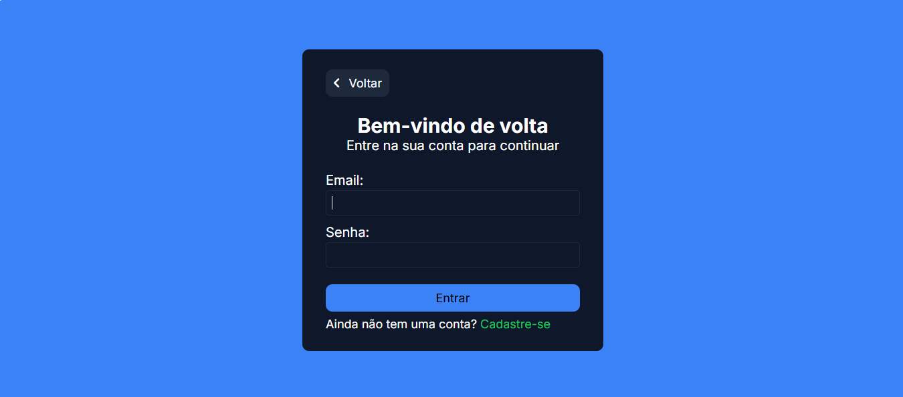
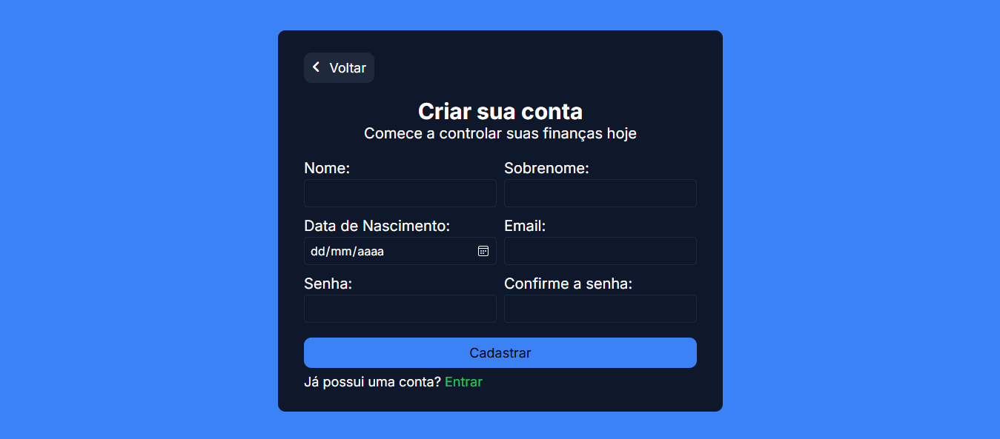
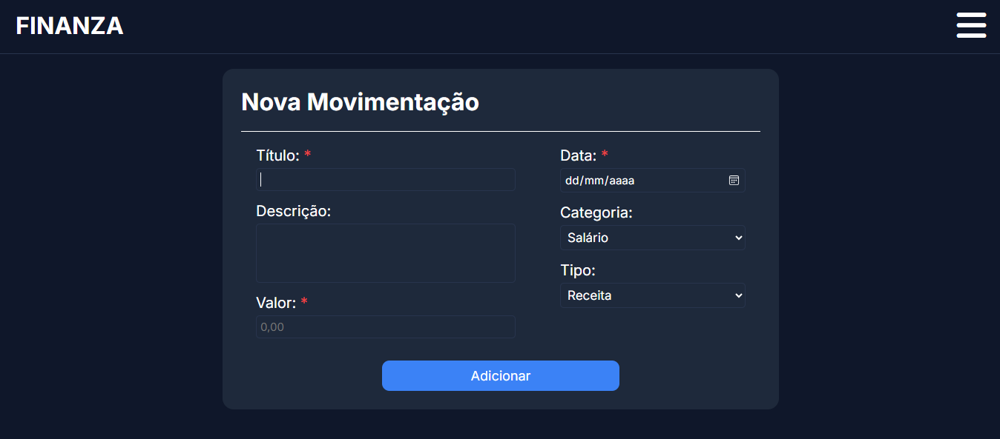
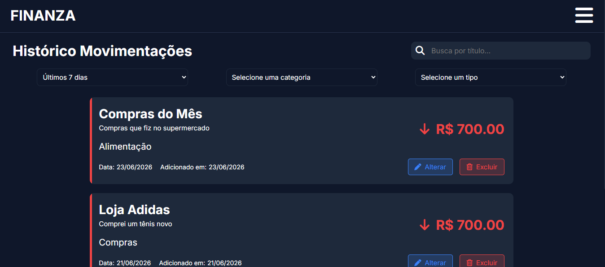
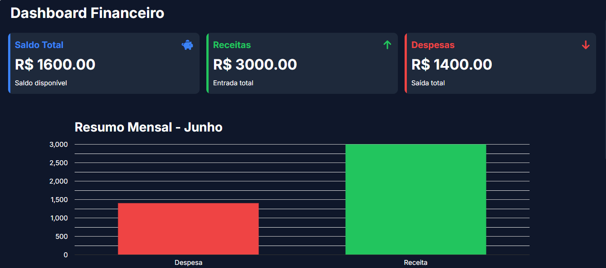
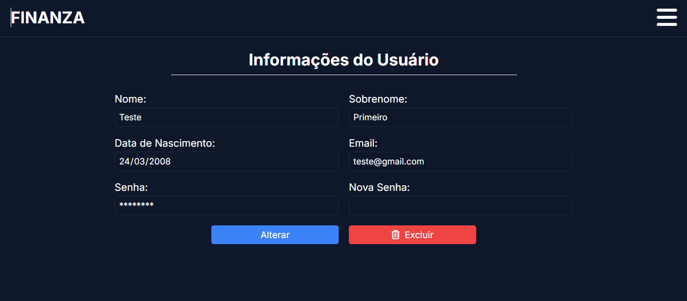

# FINANZA 💰
Sistema Web para gerenciamento financeiro pessoal, permitindo o cadastro de usuários, autenticação segura e o controle de movimentações financeiras de forma simples e intuitiva.

👩🏻‍💻 Desenvolvido por [Karina Vicente](https://github.com/kahvicentee) 

## 📖 Sobre o Projeto
O FINANZA nasceu com o objetivo de ajudar usuários a organizarem suas finanças pessoais através de uma interfacfe moderna e intuitiva.

O projeto está sendo desenvolvido para praticar conceitos de desenvolvimento Full-Stack, incluindo criação de interfaces com React, desenvolvimento de APIs com Node.js e manipulação de bancos de dados relacioais com MySQL.

## 🔧 Tecnologias Utilizadas
### Frontend
* React.js
* React Router DOM
* React-google-chart (Gráficos)
* Axios
* SASS

### Backend
* Node.js
* Express.js
* JWT (Autenticação)
* Bycript (Envia senha criptografada para o Banco)

### Banco de Dados
* MySQL

### Ferramentas
* VS Code
* Thunder Client
* Git
* GitHub

## ⚙️ Funcionalidades
### Usuários
* Cadastro e Login de usuários
* Validação de formulário
* Criptografia de senhas
* Autenticação por token

### Financeiro
* Cadastro de movimentações
* Listagem de movimentações
* Controle de receitas e despesas
* Cálculo automático de saldo

## 📸 Imagens do Projeto

  
  

  
  

  
  

  
  

## 📚 Aprendizados
Durante o desenvolvimento deste projeto foram praticados conceitos como:

* Componentização com React;
* Gerenciamento de estado com Hooks;
* Consumo de APIs com Axios;
* Rotas com React Router;
* Criação de APIs REST;
* Integração Frontend e Backend;
* Modelagem de Banco de Dados;
* Autenticação de usuários;
* Tratamento de erros;
* Versionamento com Git.

## 📅 Diário de Desenvolvimento
### Dia 1 
* Estrutura inicial do projeto React;
* Organização das rotas;
* Criação das telas de Início, Login e Cadastro.

### Dia 2 
* Criação do banco de dados;
* Desenvolvimento da API;
* Implementação dos endpoints de usuários;
* Integração entre Frontend e Backend.

### Dia 3
* Criação das telas de Movimentação (Adicionar e Consultar);
* Implementação dos endpoints das movimentações.

### Dia 4 e 5
* Continuando a implementação dos endpoints de usuários e movimentações.

### Dia 6
* CRUD da tabela de usuários finalizado;
* Páginas relacionadas ao usuário (Login, Cadastro e Minha Conta) finalizadas;
* CRUD da tabela de movimentações finalizado.

### Dia 7
* Implementanto biblioteca react-google-charts para geração de Gráficos;
* Criação de endpoints para buscar as informações dos Gráficos;
* Ajustando responsividade em algumas partes que não estavam responsivas;
* Finalizando a identidade visual do site (ajustando textos e fontes).

### Dia 8 e Dia 9
* Implementação biblioteca bycript para criptografar senha no Banco de Dados;
* Implementando lógica para geração de Gráfico Personalizado;
* Pesquisando e estudando sobre automação de planilhas com Python e outras bibliotecas.

### Dia 10
*

## 📄 Licença
Este projeto foi desenvolvido para fins de estudo e prática de desenvolvimento Backend.